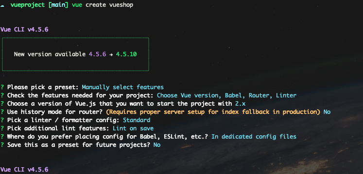
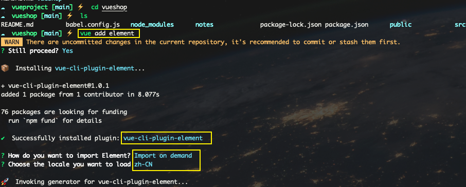
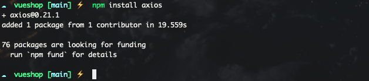
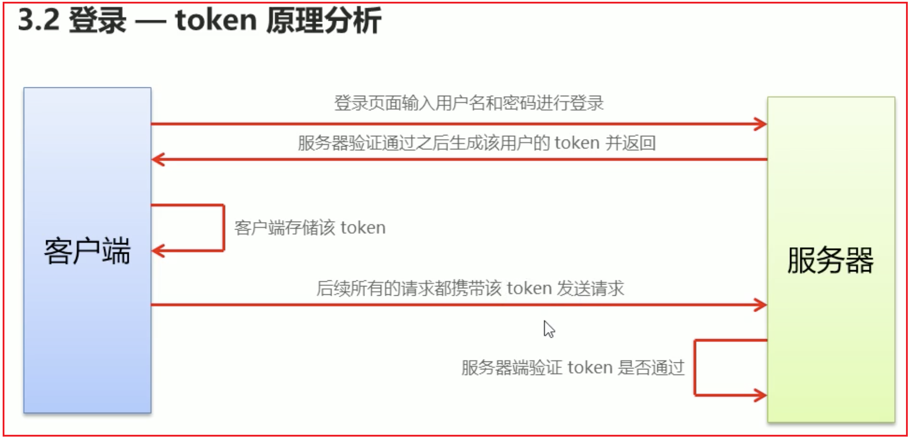

# 项目搭建

使用脚手架创建项目



安装element-ui



安装axios



安装less

```js
npm install less less-loader --save-dev
```

# 登录模块

登录时server和client不存在跨域问题情况：采用cookie和session记录状态；反之如果存在跨域，需要使用token方式维持状态？？？

- token原理分析



- 阿里第三方密码icon使用

- 将登录成功之后的token,保存在客户端的sessionStorage中，token 只在当前网站打开期间生效，所以保存在 sessionStorage而不是localStorage

- 使用`路由导航守卫`控制访问权限。比如如果用户没有登录，但是直接通过URL访问特定页面，需要重新导航到登录页面

- 用户退出功能实现：先销毁token就行了，接着跳转到登录页

- 授权API访问：其他接口请求时，必须在请求头中使用 'Authorization' 字段，并且使得该字段等于token值


# 首页页面布局

- 菜单列表联动处理


# 用户管理模块

- 前端实现分页
- 增加关键字查询后端查询逻辑


# 侧边栏模块

- 外部icon导入
- menu菜单栏右边border对不齐，找对应的`el-menu`类名，给其手动设置 `border-right: none`


# elementUI知识点记录

- elemenUI标签就是类名；比如`el-table-column` 直接使用`.el-table-column`

- 行内样式问题：暂时没发现行内样式生效

- style的scope问题导致的手动设置样式不生效，因为scope会默认给当前组件的每个元素增加一个类似于data-v-xxx的唯一标识，表示当前组件的样式只在当前组件生效，也正是因为如此，手动设置的样式需要找到匹配的元素，但是有了data-v-xxx这个标识导致匹配不到；进而手动设置的样式不生效，但是去除scope属性，直接设置样式又会导致全局样式污染；所以我们可以在使用elementUI的组件时，手动再其外部再包装一层div。

```css
/* 示例： */
.detail {
    .el-input__inner {
        height: 48px;
    }
}
/* 直接写style注意不要加scoped，然后用一个组件最外层的class包裹住，就不会改到所有的组件的样式了。 */
```


# axios

封装axios，包含请求拦截器对每个请求加`Authorization`进行授权访问

post请求还需要给参数进行编码

## 图片上传（参见Add.vue）

el-upload组件上传图片不走axios请求，所以之前在axios请求拦截器中添加token，也带不到upload上传中，需要手动给el-upload指定header

# 项目设计把控

路由层面


# 插件

```js
// 富文本编辑器插件
npm install vue-quill-editor --save

// 树形table
npm install vue-table-with-tree-grid --save

lodash库 cloneDeep
```


## scoped问题

scoped中设置的样式只会对当前vue组件生效，并不对当前组件内部的子组件生效

我们在scoped样式中，设置元素样式，被设置的元素样式都带有类似`data-v-1233`这种class，这是scoped添加的元素样式唯一。

如果在A.vue组件中使用了比如富文本编辑器`vue-quill-editor`，那么scoped中没办法设置它的样式，此时可以去全局App.vue中设置，我们App.vue相当于根容器，没有设置scoped，所以是可以设置的


